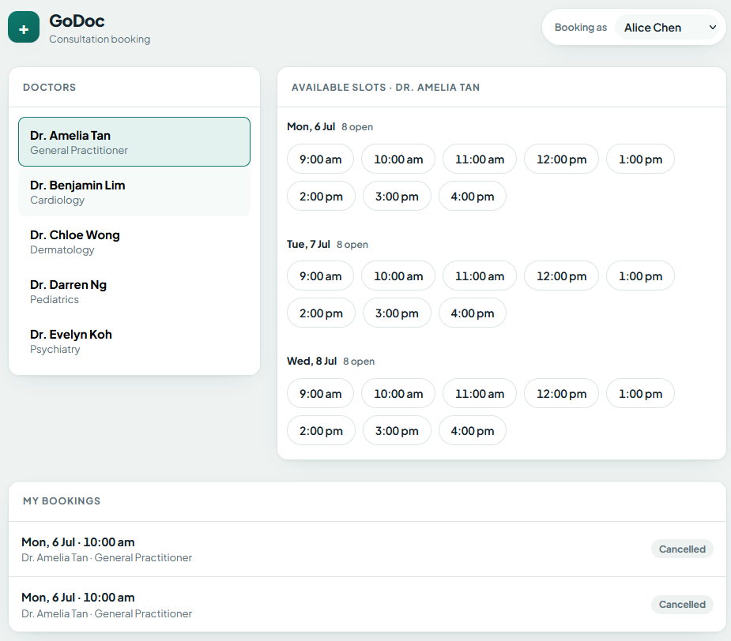
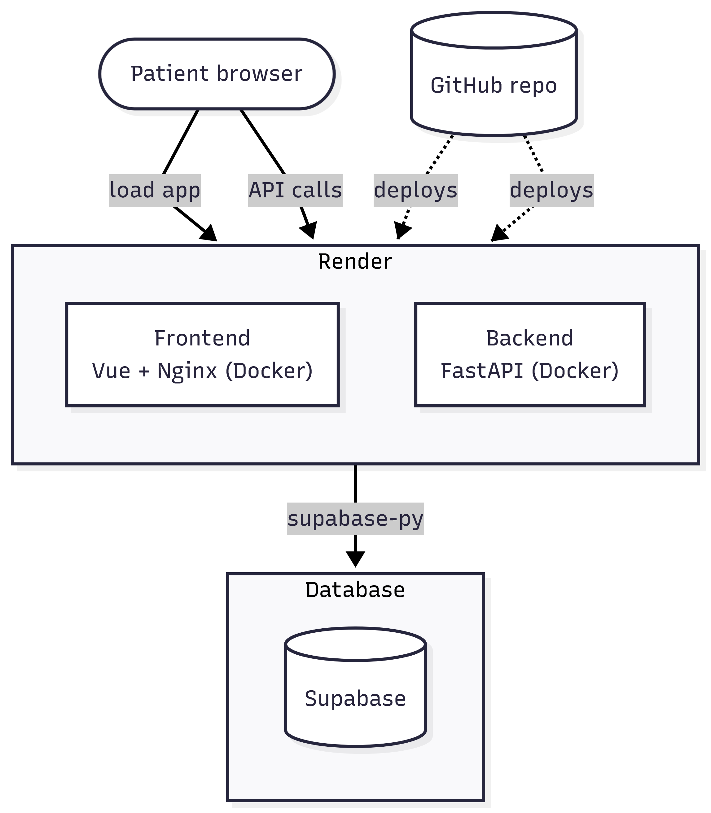
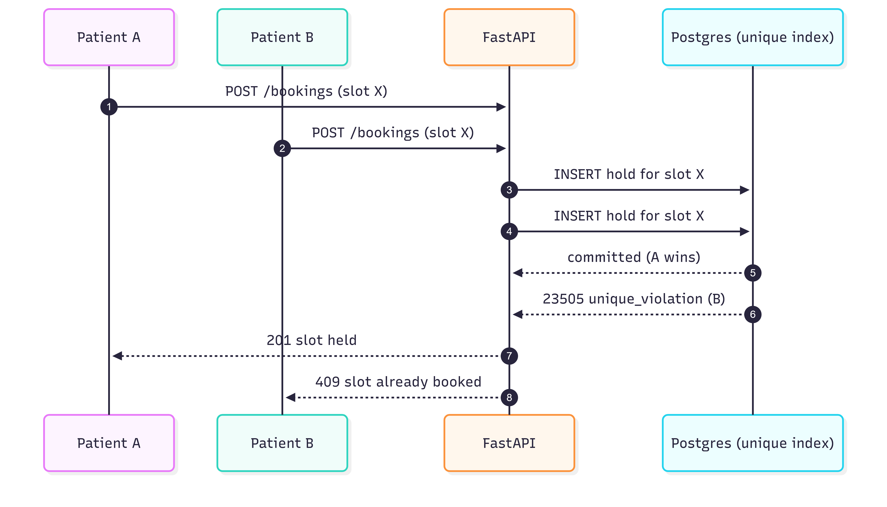
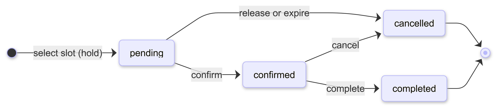
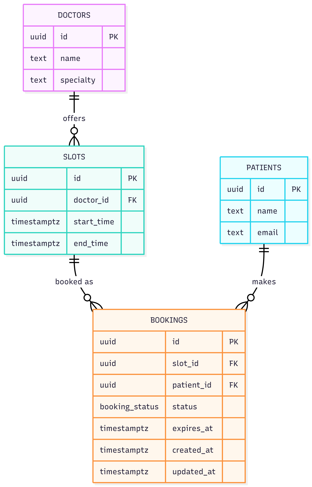

# GoDoc Consultation Booking System

[](https://godoc-booking-web.onrender.com/)

_On Render's free tier, so the first load can take up to a minute while the services wake._



A small end-to-end consultation booking flow. A patient views a doctor's open slots and
books one, and the system stays correct when two people try to grab the same slot at the
same time. Built for the GoDoc take-home (Scope 1).

Postgres does the heavy lifting for correctness, FastAPI holds the business rules, and Vue is
a light UI on top. The frontend never talks to Supabase directly, so the database key stays on
the server and there is one place where the rules live.

Two simplifying assumptions for the demo: there is no authentication (you act as one of the
seeded patients through a switcher, standing in for a real login and auth token), and there is
no current-time check (any seeded slot can be booked, even one in the past, whereas a real
system would only offer future slots).

## Tech stack

- **Postgres (Supabase)** because the core problem is correctness under concurrency, and a
  relational database with unique constraints solves that declaratively. Supabase gives managed
  Postgres with no setup. Trade-off: we lean on a hosted service instead of running our own DB.
- **FastAPI** for a small, fast Python backend that keeps the booking rules and state machine
  in one testable place and keeps the database key off the browser. Trade-off: it adds a hop a
  browser-to-Supabase setup would not have, worth it for the clean seam.
- **supabase-py** as the official client, using the provided key with minimal setup. Trade-off:
  it goes through PostgREST rather than a raw connection, so there are no hand-rolled SQL
  transactions, which we do not need here because correctness lives in a constraint.
- **Vue 3 + Vite + TypeScript** for a light single-page app that pairs well with a separate API.
  The brief calls for a modern JS framework, and Vue keeps the footprint small for a UI this
  size. Trade-off: a fuller framework like Next or Nuxt would overlap with the Python backend and
  add redundancy here.
- **Render** for deployment because it has a usable free tier, deploys straight from a GitHub
  repo, and reads a `render.yaml` blueprint to set up both services at once, with a simple
  dashboard and logs. Trade-off: free instances cold start after a period of idle, so the first
  request can be slow.

## Architecture



Both the FastAPI backend and the Vue frontend (served by nginx) run as Docker web services on
Render, deployed straight from the GitHub repo via the `render.yaml` blueprint. The same
containers run anywhere, including locally with `docker compose`. Supabase is a managed service
outside Render.

## Preventing double booking

This is the part that matters most. If two requests both "check if the slot is free, then
insert a booking", there is a window between the check and the insert where both see the
slot as free and both write. That is a double booking.

Instead of checking-then-writing, the database itself guarantees the rule with a partial
unique index:

```sql
create unique index one_active_booking_per_slot
  on bookings (slot_id)
  where status in ('pending', 'confirmed');
```

Creating a booking is a single atomic `INSERT` (a short pending hold). When two inserts race
for the same slot, Postgres serializes them on that index. Exactly one commits. The other one
fails with a unique violation (Postgres error `23505`), which the backend catches and turns
into an HTTP `409`.



The winner is simply whoever gets there first. There is no priority or queue: if patients A and B
are both looking at the same open slot and click at nearly the same moment, whichever request
reaches the index first commits and takes the slot, and the other gets the `409`. A slightly
faster click wins.

A few reasons this is the shape I went with:

- There are no application locks. The database is the single source of truth, so you
  can run several copies of the API and they all stay correct.
- Rebooking still works. The index only covers active bookings, so once a booking is
  cancelled the slot is free again.

There is a test that proves this: it fires many concurrent bookings at one slot and checks
that exactly one succeeds and the rest get a conflict (`backend/tests/test_concurrency.py`).

## Booking states

A booking moves through `pending`, `confirmed`, `cancelled`, or `completed`. Valid transitions
are enforced in one place (`backend/app/state_machine.py`), and an illegal move (for example
completing a cancelled booking) is rejected with a `409`.



Booking is a two-step flow. Selecting a slot creates a short `pending` hold (five minutes) that
reserves the slot right away, so nobody else can take it while the patient confirms. The patient
confirms their own hold, which moves it to `confirmed`; there is no separate clinic approval
step. Releasing or cancelling frees the slot. Payment is not part of this, since the clinic bills
after the consultation, so the hold is just there to make the booking step safe.

Abandoned holds are freed by lazy expiry: before listing availability or creating a booking, any
`pending` row past its `expires_at` is cancelled, so the slot reappears the moment someone looks
again. A slot can therefore stay held for a few seconds past expiry, until the next read or
booking sweeps it; a background job like pg_cron would tighten this at scale.

Selecting a slot always writes a `pending` row (the row is what reserves the slot), so a released
or expired hold leaves a `cancelled` row behind. These are harmless, since the index and the
availability query only consider active bookings, and a cleanup job would prune them at scale.

## Database



- `doctors`, `patients`, `slots`, and `bookings`, with foreign keys as shown.
- A slot is available when no active (`pending` or `confirmed`) booking points at it.
  Availability is worked out from the data, not stored as a flag that could drift. It is a
  couple of small queries today; at larger scale it would be a single joined query or a view.
- Slot times are stored as `timestamptz` and shown in UTC in the UI, so the demo always shows
  the seeded clinic hours (09:00 to 16:00) regardless of the viewer's timezone.
- `bookings.expires_at` is the deadline for a `pending` hold. Expired holds are cancelled
  lazily on the next read or booking.
- `updated_at` on `bookings` is maintained by a database trigger (`moddatetime`).
- The full schema and seed data live in [`db/001_schema.sql`](db/001_schema.sql) and
  [`db/002_seed.sql`](db/002_seed.sql).

## API

| Method | Route | Purpose |
|---|---|---|
| `GET` | `/doctors` | List doctors |
| `GET` | `/doctors/{id}/slots` | Available slots for a doctor |
| `GET` | `/patients` | List patients (stands in for login) |
| `GET` | `/patients/{id}/bookings` | A patient's bookings, with slot and doctor |
| `POST` | `/bookings` | Hold a slot `{slot_id, patient_id}`, creates a `pending` hold, `201` or `409` if taken |
| `POST` | `/bookings/{id}/confirm` | `pending` to `confirmed`, `409` if the hold expired |
| `POST` | `/bookings/{id}/cancel` | `pending` or `confirmed` to `cancelled` |
| `POST` | `/bookings/{id}/complete` | `confirmed` to `completed` |
| `GET` | `/health` | Liveness |

Error codes: `404` for an unknown slot, patient, or booking, `409` for a slot that is
already booked or an invalid state transition, and `422` for a bad request body. Interactive
docs are at `/docs` when the backend is running.

## Running locally

The Supabase project is already set up and its credentials are committed in `backend/.env` and
`frontend/.env`, so there is nothing to configure. You can run it with Docker, or directly with
Python and Node.

### With Docker

From the repo root, build and start both containers:

```bash
docker compose up --build
```

Then open `http://localhost:8080`. These are the same images that deploy to Render.

### Without Docker

You need Python 3.11+ and Node 18+.

Backend:

```bash
cd backend
python -m venv .venv
source .venv/Scripts/activate      # Windows Git Bash. Use .venv/bin/activate on macOS or Linux
pip install -r requirements.txt
uvicorn app.main:app --reload --port 8000
```

If port 8000 is busy, use another port and update `VITE_API_BASE_URL` in `frontend/.env`.

Frontend:

```bash
cd frontend
npm install
npm run dev
```

## Tests

```bash
cd backend
pytest
```

Tests cover the concurrency race (`test_concurrency.py`), the state machine
(`test_state_machine.py`), and booking, hold expiry, and availability behaviour
(`test_bookings.py`). They run against the real Supabase project, since the race test is only
meaningful against a real Postgres, and they clean up after themselves. The same tests plus a
frontend build run in CI on every push (`.github/workflows/tests.yml`).
